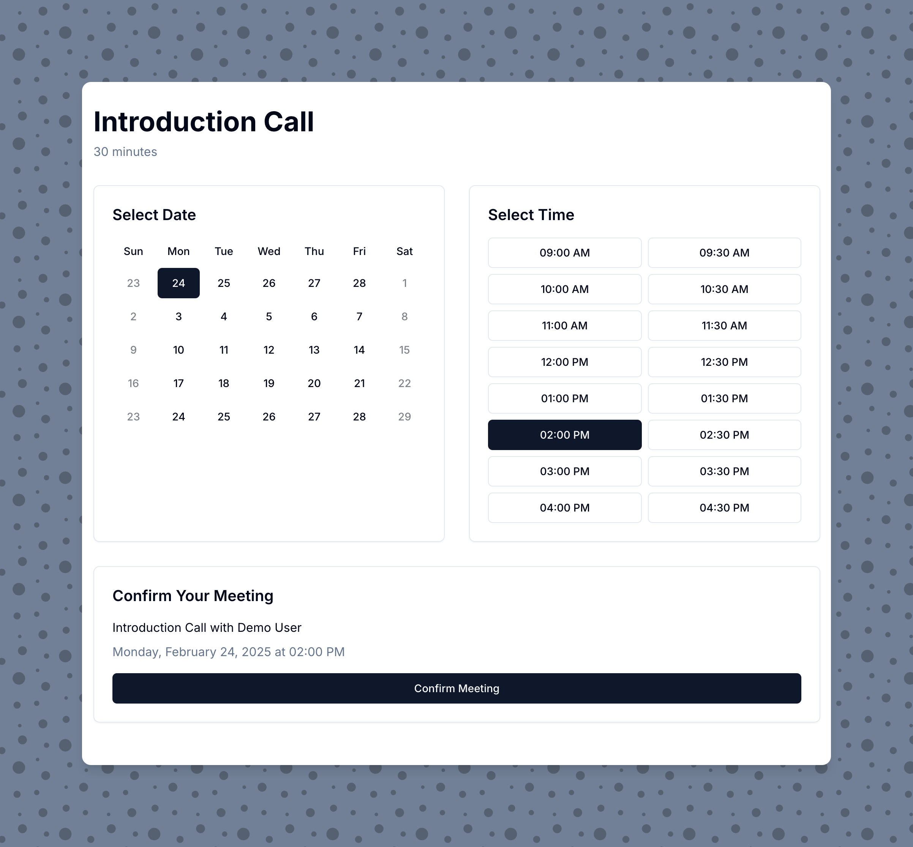
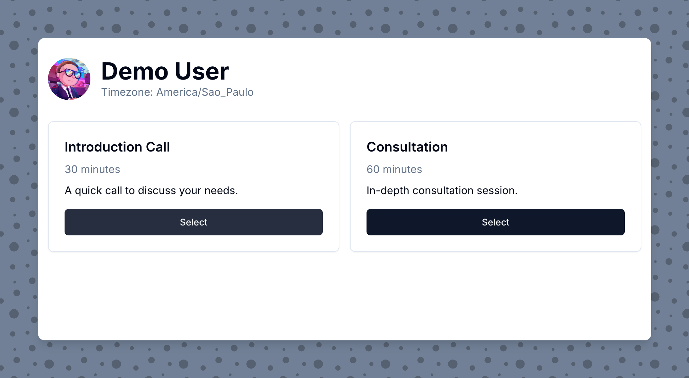

# WIP - Cal Clone

A GitHub Pages-based scheduling application similar to Calendly or TidyCal. This app allows users to display their availability and let visitors book time slots for meetings.



## Features

- Display multiple meeting types with different durations
- Calendar view for date selection
- Time slot selection based on availability
- Customizable settings via a JSON configuration file
- Integration with Google Calendar API
- Mobile-responsive design using shadcn/ui components
- Easy deployment to GitHub Pages

## Demo

You can see a live demo of this application at: [https://ctrimm.github.io/cal-clone](https://ctrimm.github.io/cal-clone)

## Getting Started



### Prerequisites

- Node.js (v14 or higher)
- npm or yarn
- A GitHub account
- A Google account with Calendar API access

### Installation

1. Clone this repository:
   ```bash
   git clone https://github.com/ctrimm/cal-clone.git
   cd cal-clone
   ```

2. Install dependencies:
   ```bash
   npm install
   ```

3. Configure your application by editing the `public/config.json` file.

4. Start the development server:
   ```bash
   npm start
   ```

5. Open [http://localhost:3000](http://localhost:3000) to see your application.

### Running Locally

To run the application locally for development:

1. Make sure you have completed the installation steps above.

2. The application uses either mock calendar data in development or Google Calendar integration in production. By default, it uses mock data when running locally.

3. (Optional) To use Google Calendar integration locally:
   - Create a project in [Google Cloud Console](https://console.cloud.google.com)
   - Enable the Google Calendar API
   - Create OAuth 2.0 credentials:
     - Go to "APIs & Services" > "Credentials"
     - Click "Create Credentials" > "OAuth client ID"
     - Choose "Web application"
     - Add `http://localhost:3000` to authorized JavaScript origins
     - Add `http://localhost:3000` to authorized redirect URIs
   - Create a `.env` file in the root directory with:
     ```
     REACT_APP_GOOGLE_CLIENT_ID=your_client_id_here
     REACT_APP_GOOGLE_API_KEY=your_api_key_here
     ```

4. Start the development server:
   ```bash
   npm start
   ```

5. The application will be available at [http://localhost:3000](http://localhost:3000).

6. Calendar Integration Modes:
   - Development (default): Uses mock calendar data with randomly generated events
   - Production: Uses Google Calendar API to fetch real events and create new ones
   - To force Google Calendar in development, add both REACT_APP_GOOGLE_CLIENT_ID and REACT_APP_GOOGLE_API_KEY to your .env file

7. To build for production:
   ```bash
   npm run build
   ```

8. To test the production build locally:
   ```bash
   npx serve -s build
   ```
   This will serve your production build at [http://localhost:5000](http://localhost:5000).

## Configuration

The application is configured using the `public/config.json` file. Here's what each section does:

### Profile

Contains your basic information:

```json
"profile": {
  "name": "Your Name",
  "imageUrl": "https://your-image-url.jpg",
  "timezone": "America/New_York"
}
```

### Meeting Types

Define different types of meetings that people can book:

```json
"meetingTypes": [
  {
    "id": "intro-call",
    "title": "Introduction Call",
    "duration": 30,
    "description": "A quick call to discuss your needs.",
    "additionalInfo": "No preparation needed.",
    "price": 0
  }
]
```

### Availability

Configure your working hours and booking constraints:

```json
"availability": {
  "workingHours": {
    "start": "09:00",
    "end": "17:00"
  },
  "workingDays": [1, 2, 3, 4, 5],
  "slotDuration": 15,
  "bufferBetweenMeetings": 15,
  "maxBookingWindow": 60
}
```

### Google Calendar Integration

This application uses GitHub Actions to sync with your Google Calendar. It periodically fetches your calendar's busy times and stores them in a static JSON file, which is then used by the frontend to display your availability. When someone books a meeting, it triggers another GitHub Action to create the event in your calendar.

#### Setup Steps:

1. Create a Google Cloud Project:
   - Go to [Google Cloud Console](https://console.cloud.google.com)
   - Create a new project
   - Enable the Google Calendar API
   - Create OAuth 2.0 credentials (Web application type)
   - Download the client credentials

2. Get your refresh token:
   ```bash
   # Install dependencies for the token script
   npm install dotenv googleapis open
   
   # Create a .env file with your credentials
   echo "REACT_APP_GOOGLE_CLIENT_ID=your_client_id" >> .env
   echo "GOOGLE_CLIENT_SECRET=your_client_secret" >> .env
   
   # Run the script to get your refresh token
   node scripts/get-refresh-token.js
   ```

3. Add GitHub repository secrets:
   - Go to your repository's Settings > Secrets and variables > Actions
   - Add the following secrets:
     - `GOOGLE_CLIENT_ID`: Your Google OAuth client ID
     - `GOOGLE_CLIENT_SECRET`: Your Google OAuth client secret
     - `GOOGLE_REFRESH_TOKEN`: The refresh token from step 2
     - `GITHUB_TOKEN`: A personal access token with `repo` scope

4. Update your repository settings:
   - Go to Settings > Actions > General
   - Under "Workflow permissions", select "Read and write permissions"
   - Save the changes

The application will now:
- Sync your calendar availability every 15 minutes
- Create new events in your calendar when visitors book meetings
- Keep your privacy by not exposing actual event details

### UI Customization

Customize the appearance:

```json
"ui": {
  "primaryColor": "#000000",
  "secondaryColor": "#4f46e5",
  "backgroundColor": "#ffffff",
  "fontFamily": "'Inter', sans-serif"
}
```

## Setting Up Google Calendar API

To use this application with Google Calendar, you need to set up API access:

1. Go to the [Google Cloud Console](https://console.cloud.google.com/).

2. Create a new project or select an existing one.

3. Enable the Google Calendar API:
   - Go to "APIs & Services" > "Library"
   - Search for "Google Calendar API"
   - Click on it and enable it

4. Create credentials:
   - Go to "APIs & Services" > "Credentials"
   - Click "Create Credentials" and select "OAuth client ID"
   - Choose "Web application" as the application type
   - Add authorized JavaScript origins (your GitHub Pages URL, e.g., https://yourusername.github.io)
   - Add authorized redirect URIs (your GitHub Pages URL, e.g., https://yourusername.github.io/cal-clone)
   - Click "Create"

5. Note your Client ID and update the `config.json` file with it.

6. Set up consent screen:
   - Go to "APIs & Services" > "OAuth consent screen"
   - Fill in the required information (app name, user support email, developer contact information)
   - Add the necessary scopes (./auth/calendar, ./auth/calendar.events)
   - Add test users (including your own email)
   - Save and continue

## Deployment to GitHub Pages

This application is automatically deployed to GitHub Pages using GitHub Actions. The deployment workflow:

1. Builds the application with the correct environment variables
2. Creates necessary files for GitHub Pages SPA support (404.html, .nojekyll)
3. Deploys to the gh-pages branch

### Required Environment Setup

1. In your repository's Settings > Secrets and variables > Actions, add these secrets:
   - `GOOGLE_CLIENT_ID`: Your Google OAuth client ID
   - `GOOGLE_API_KEY`: Your Google Calendar API key
   - `GITHUB_TOKEN`: Automatically provided by GitHub Actions

2. In your repository's Settings > Pages:
   - Set the source to "Deploy from a branch"
   - Select the "gh-pages" branch
   - Save the changes

### Development Environment

For local development:

1. Create a `.env` file in the root directory:
   ```bash
   # Development environment variables
   PUBLIC_URL=""
   REACT_APP_GOOGLE_CLIENT_ID="your-client-id"
   REACT_APP_GOOGLE_API_KEY="your-api-key"
   ```

2. Start the development server:
   ```bash
   npm start
   ```

The application will use mock calendar data in development unless you provide valid Google Calendar credentials.

### Production Environment

The production environment variables are automatically set by the GitHub Actions workflow in `.github/workflows/deploy.yml`. The workflow:

1. Sets `PUBLIC_URL` to your GitHub Pages URL
2. Injects Google Calendar credentials from repository secrets
3. Creates necessary files for GitHub Pages hosting

After pushing to the main branch, your application will be automatically deployed to `https://[username].github.io/pages-cal`

## Custom Domain Setup

To use your own domain with this application:

1. Configure your DNS provider to point to GitHub Pages:
   - Create a CNAME record pointing your subdomain (e.g., `cal.yourdomain.com`) to `yourusername.github.io`

2. Add a CNAME file to the `public` directory with your domain:
   ```
   cal.yourdomain.com
   ```

3. Update the `homepage` field in `package.json`:
   ```json
   "homepage": "https://cal.yourdomain.com"
   ```

4. In your GitHub repository, go to Settings > Pages:
   - Under "Custom domain", enter your domain (e.g., `cal.yourdomain.com`)
   - Check "Enforce HTTPS" when available

## Project Structure

```
cal-clone/
├── public/
│   ├── favicon.ico
│   ├── index.html
│   └── config.json          # Configurable JSON file for meeting types
├── src/
│   ├── components/          # Reusable UI components
│   ├── pages/               # Pages for each route
│   ├── utils/               # Utility functions
│   ├── App.jsx              # Main App component with routing
│   ├── index.jsx            # Entry point
│   └── styles.css           # Global styles
```

## Customization

### Themes and Styling

The application uses Tailwind CSS and shadcn/ui components, which can be customized:

1. Edit the `src/styles.css` file to change global styles.
2. Update theme variables in the same file to change colors, fonts, etc.
3. Use the `ui` section in `config.json` to customize colors and fonts without code changes.

### Adding New Features

You can extend this application with additional features:

- Payment integration (e.g., Stripe)
- Email notifications
- SMS reminders
- Recurring meetings
- Team scheduling
- Custom form fields

## Contributing

Contributions are welcome! Please feel free to submit a Pull Request.

## License

This project is licensed under the MIT License - see the LICENSE file for details.

## Acknowledgments

- [shadcn/ui](https://ui.shadcn.com) for the beautiful UI components
- [React](https://reactjs.org)
- [Tailwind CSS](https://tailwindcss.com)
- [date-fns](https://date-fns.org) for date handling
